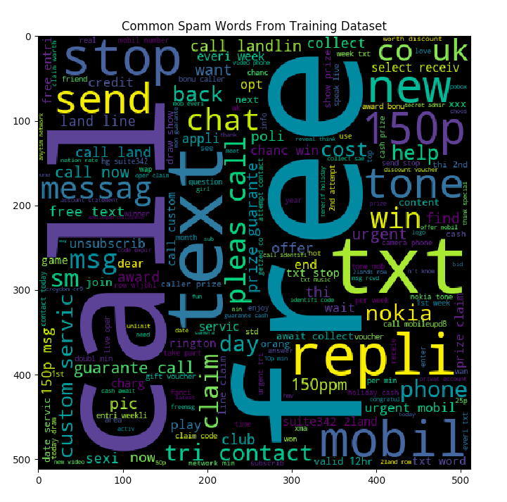

Detecting Spam Text Messages Using a Naive Bayes' Classifier
============


Introduction
---------

As spam text messages are becoming more sophisticated and difficult to detect by humans,
we can apply analytical techniques to better predict the presence of spamming attempts. This report seeks to create 
a model to efficiently detect spam text messages and provide an analysis of the most common phrases that could
signify a spam attempt. 

Methodology
----------
Using the datasets found at [this link](http://spamassassin.apache.org/old/publiccorpus/), we can construct training
and testing datasets for our model through the 80/20 rule. We will use 80% of the dataset to train our model to recognize 
spam message, and the remaining 20% to conduct an analysis of the model's effectiveness. As our dataset has a column of 
text followed by a label indicating whether or not the message is spam, we can use these labels to verify the accuracy
of our model. Based on these labels we have the following distributions in our testing and training sets: 

- Training Set: 519/3900 messages are spam (14%)
- Testing Set: 228/1674 messages are spam (13.6)
- Full Dataset: 747/5572 messages are spam (13.4%)

As the training, testing, and full datasets have similar spam distributions, we can use them to measure the accuracy
of our spam detection model.

The code in `classifier.py` reads data from our training and testing sets, applying the following methods: 
 
- `trainer():` reads data from our dataset_train.csv file and imports the data into a Pandas DataFrame. We then apply
the porter stemmer algorithm to train our model to identify spam words. This function also outputs a WordCloud visualization
of the most common spam word roots in our training set (visualization included below). 

- `porter_stemmer():` takes a text message and splits it into tokens (words and prefixes). This method 
uses the Porter Stemmer algorithm, a stemming algorithm that identifies roots of words for more accurate spam classification
(e.g. changes "running" and "runner" into "run"). 
- `bayes_probability():` given that a word is in our training set, we can identify the probability of 
that word being spam in our testing set through Bayes' theorem. We apply a "smoothing factor" of .7 to compensate for whenever
a word present in our testing dataset was not present in the training set. 
- `bayesProb_msg():` as we have the individual probabilities of spam for each word in a message, we can 
multiply together the probabilities to obtain the probability a message is spam. 
- `classify_msg():` classifies the message as either spam or not spam. When P(Spam) > P(Not Spam), the message 
is labelled as spam. This method also produces a WordCloud of common spam and non-spam words in the testing dataset (visualizations included below). 


- The main function of this program prints analytics regarding dataset characteristics and model accuracy to the terminal. 
More information regarding these analytics is discussed below. 


Analysis of Results
-----

-   The following 


Running the Classifier
------------

To run this code, navigate to the spamdetector directory and execute the following command:

``` {.sh}
$ python classifier.py
```
Note that you may have to install certain dependencies (e.g. the "punkt" package for punctuation detection). For the given files (dataset.csv), the following results will be printed to the terminal: 
``` {.sh}
Percent True Positives: 0.130227001195
Percent True Negatives: 0.745519713262
Percent False Positives: 0.118279569892
Percent False Negatives: 0.00597371565114
Accuracy Rate: 0.875746714456

```


